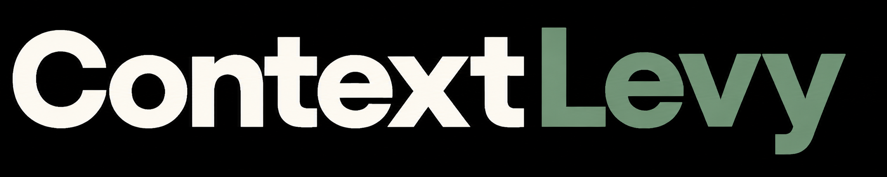
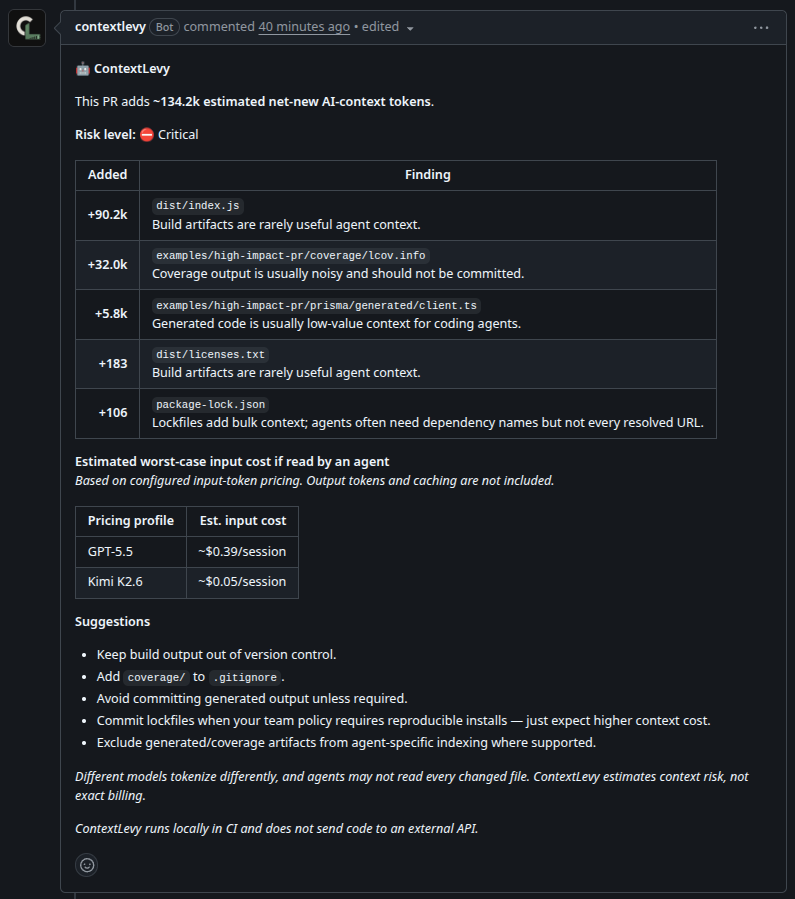

<p align="center">
  
</p>

<p align="center">
  <strong>Repo hygiene linter for agent-heavy teams.</strong>
</p>

<p align="center">
  ContextLevy flags pull requests that will make coding-agent review noisy — generated output, coverage, build artifacts, lockfile churn, and agent instruction changes — before that noise becomes repo debt.
</p>

<p align="center">
  <a href="https://github.com/apps/contextlevy/installations/new">
    
  </a>
</p>

<p align="center">
  <a href="https://github.com/nonlooped/contextlevy/actions/workflows/ci.yml">
    
  </a>
  <a href="https://github.com/nonlooped/contextlevy/releases">
    
  </a>
  <a href="https://github.com/nonlooped/contextlevy/blob/main/LICENSE">
    
  </a>
  
  
  
</p>

---

## Before / after

| Before ContextLevy | After ContextLevy |
| --- | --- |
| A PR silently adds ~90k tokens of coverage, generated clients, and build output | Reviewers see exactly which files caused the bloat and what to remove |
| Lockfile churn dominates diffs with no agent-cost signal | ContextLevy flags lockfiles, estimates token weight, and suggests review focus |
| Agent instruction files change behavior without visibility | High-signal agent config changes appear in the PR thread |

## Who is this for?

| Use ContextLevy if… | Maybe skip it if… |
| --- | --- |
| Your team uses Cursor, Codex, or Claude Code heavily | Your repo rarely uses AI agents |
| PRs often include generated output or coverage artifacts | You already have strict artifact hygiene and pre-commit gates |
| You want advisory PR comments before merge | You need exact tokenizer-accurate billing from your provider |
| You care about repo-level context debt, not just session tuning | You only need per-session context packs (see [ctx](https://github.com/forjd/ctx)) |

See [docs/EXAMPLES.md](docs/EXAMPLES.md) for benchmark tables, monorepo recipes, and output usage.

**Live demo:** [open example PR](https://github.com/nonlooped/contextlevy/pull/12) — ContextLevy commenting on intentional high-context fixtures ([details](examples/README.md)).

## Why ContextLevy?

AI coding agents are extremely sensitive to noisy repository context. A single PR can add generated clients, coverage, build output, lockfile churn, snapshots, logs, vendored files, and agent instruction dumps — bloating every future AI-assisted session without breaking your app.

**ContextLevy catches that before it becomes repo debt.** It scans diffs, estimates context weight, classifies risky files, and leaves a focused PR comment.

See [docs/COMPARISON.md](docs/COMPARISON.md) for how ContextLevy compares to bundle tools, [ctx](https://github.com/forjd/ctx), and agent session tools.



## What it catches

| Risk            | Examples                                            | Why it matters                                         |
| --------------- | --------------------------------------------------- | ------------------------------------------------------ |
| Generated code  | `generated/client.ts`, `schema.graphql`, SDK output | Often huge, repetitive, and better regenerated locally |
| Coverage output | `coverage/lcov.info`, `htmlcov/`                    | High token cost with almost zero agent value           |
| Build artifacts | `dist/`, `build/`, `.next/`, compiled bundles       | Frequently duplicated from source                      |
| Logs and dumps  | `*.log`, traces, debug output                       | Noisy context that agents over-read                    |
| Lockfile churn  | `package-lock.json`, `pnpm-lock.yaml`, `yarn.lock`  | Can dominate diffs in dependency PRs                   |
| Snapshots       | `__snapshots__/`, large fixture files               | Useful sometimes, expensive always                     |
| Agent files     | `.agents/`, `AGENTS.md`, instruction packs          | Can silently steer future agent behavior               |

## Privacy model

ContextLevy is intentionally boring:

* **No LLM calls**
* **No code upload**
* **No external analysis service**
* **No telemetry required**

It only uses GitHub pull request metadata and diff patches available inside the workflow. Token and cost numbers are estimates, not billing-grade accounting.

## Quick start

```bash
# Scan your diff locally (no config required)
npx contextlevy check --base main

# Scaffold config + optional workflow
npx contextlevy init
npx contextlevy init --workflow --mode strict
```

See [docs/QUICKSTART.md](docs/QUICKSTART.md) for modes, allowlists, and pre-push hooks.

### GitHub Action (optional)

After `contextlevy init --workflow`, or add manually:

Install the [ContextLevy GitHub App](https://github.com/apps/contextlevy) for best comment attribution (optional — `GITHUB_TOKEN` works for many repos).

#### 1. Install the ContextLevy GitHub App

Install the app on your repository. Grant:

| Permission    |       Access |
| ------------- | -----------: |
| Contents      |         Read |
| Pull requests | Read & write |
| Issues        | Read & write |

The published app posts PR comments with its own identity — no repository secrets required. After changing app permissions, accept the updated installation request on the repository.

#### 2. Add the workflow

Create `.github/workflows/contextlevy.yml`:

```yaml
name: ContextLevy

on:
  pull_request:
    types: [opened, synchronize, reopened]

permissions:
  contents: read
  pull-requests: write
  issues: write

jobs:
  contextlevy:
    name: Check repo context hygiene
    runs-on: ubuntu-latest

    steps:
      - uses: actions/checkout@v4

      - uses: nonlooped/contextlevy@v2
        with:
          github-token: ${{ github.token }}
```

That is the full setup. ContextLevy reads your PR diff, estimates context weight, and comments when thresholds are exceeded.

Add `contextlevy.config.yml` to tune thresholds, ignore paths, and fail modes — see [docs/CONFIG.md](docs/CONFIG.md).

### Simple mode: `GITHUB_TOKEN` only

Works for many internal PRs without installing the app. Fork PRs may be read-only — see [docs/ACTION.md](docs/ACTION.md#fork-pull-requests).

> **Maintainers and contributors only:** To test with a self-hosted GitHub App in a private fork, see [CONTRIBUTING.md — Self-hosted GitHub App](CONTRIBUTING.md#self-hosted-github-app-maintainers-and-contributors-only).

## Local CLI

`check` is the recommended command (`diff` is an alias):

```bash
npm install -g contextlevy
contextlevy check --base main
contextlevy check --base origin/main --format json --fail-on-config
contextlevy check --strict
contextlevy init --workflow
```

See [docs/CLI.md](docs/CLI.md) for flags, exit codes, and pre-push hook recipes.

### Agent skills

Teach coding agents how to set up and use ContextLevy:

```bash
npx skills add nonlooped/contextlevy
```

The interactive wizard lists every skill in [.agents/skills/](.agents/skills/) — pick `contextlevy` (GitHub Action), `contextlevy-cli` (local CLI), or both.

Skill sources: [.agents/skills/contextlevy/SKILL.md](.agents/skills/contextlevy/SKILL.md) · [.agents/skills/contextlevy-cli/SKILL.md](.agents/skills/contextlevy-cli/SKILL.md)

## Documentation

| Doc | Description |
| --- | --- |
| [docs/QUICKSTART.md](docs/QUICKSTART.md) | 60-second local setup, modes, allowlists |
| [docs/CONFIG.md](docs/CONFIG.md) | Config paths, options, severity, estimation, recipes |
| [docs/ACTION.md](docs/ACTION.md) | Action inputs, outputs, job summary, fork PRs |
| [docs/CLI.md](docs/CLI.md) | Local CLI install, flags, exit codes, hooks |
| [docs/EXAMPLES.md](docs/EXAMPLES.md) | Benchmark tables, monorepo recipes, output usage |
| [docs/COMPARISON.md](docs/COMPARISON.md) | vs bundle tools, ctx, session tools, `.gitattributes` |
| [docs/TROUBLESHOOTING.md](docs/TROUBLESHOOTING.md) | Permissions, missing comments, bad estimates |
| [docs/DEVELOPMENT.md](docs/DEVELOPMENT.md) | Build, test, release, trusted publishing |
| [docs/ARCHITECTURE.md](docs/ARCHITECTURE.md) | Pipeline, module map, dependency rules |
| [CONTRIBUTING.md](CONTRIBUTING.md) | Contributor setup and PR expectations |
| [SECURITY.md](SECURITY.md) | Security policy and fork PR permissions |

## Security

ContextLevy is a pull request analysis tool. It does not execute changed code and does not send repository contents to an LLM or third-party API.

Please report security issues privately through GitHub Security Advisories instead of opening a public issue.

## License

MIT
